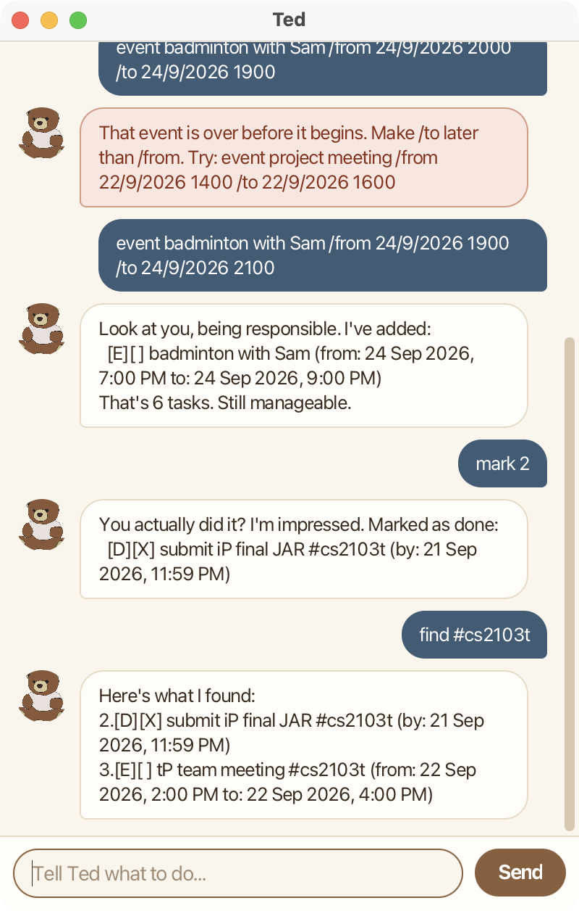

# Ted User Guide



Ted is a chatbot that keeps track of your todos, deadlines and events. You type a
short command, and Ted replies, so managing your tasks is as quick as sending a message.
Ted saves your tasks after every change, so they are still there next time you open it.

* [Quick start](#quick-start)
* [Features](#features)
* [Saving your tasks](#saving-your-tasks)
* [Command summary](#command-summary)

## Quick start

1. Make sure you have Java 25 installed. On a Mac, use a Java 25 build that includes
   JavaFX, such as [Azul Zulu JDK FX](https://www.azul.com/downloads/?version=java-25-lts&package=jdk-fx).
1. Download the latest `ted.jar` from the [releases page](https://github.com/trigg770/ip/releases).
1. Put `ted.jar` in the folder where you want Ted to keep its data, e.g. an empty folder
   named `Ted`.
1. Open a terminal in that folder and run:

   ```
   java -jar ted.jar
   ```

1. Ted's window opens with a greeting. Type a command in the box at the bottom and press
   Enter (or click **Send**). For example, try:
   * `todo borrow book` adds a todo.
   * `list` shows all your tasks.
   * `bye` closes Ted.

## Features

**How to read the command formats**

* Words in `UPPER_CASE` are details you supply. In `todo DESCRIPTION`, you might type
  `todo borrow book`.
* Items in square brackets are optional, and `...` means the item can be repeated.
  `tag INDEX #TAG [#TAG]...` means one or more tags.
* `INDEX` is the number shown next to a task by `list` or `find`, e.g. `2`.
* `DATE TIME` is a day, month and year, then a 24-hour time: `d/M/yyyy HHmm`,
  e.g. `25/9/2026 1800` for 25 September 2026 at 6 pm.
* Command words can be typed in any case: `list`, `List` and `LIST` all work.
* Extra spaces between words are ignored.
* If Ted cannot follow a command, it replies in red, explains what went wrong, and shows
  an example of the right format. Nothing in your list changes.

Each task is shown with two boxes in front of it:

```
[D][X] return book #library (by: 25 Sep 2026, 6:00 PM)
```

* The first box is the kind of task: `T` for a todo, `D` for a deadline, `E` for an event.
* The second box holds an `X` once the task is done.
* Tags, if any, follow the description.

### Adding a todo: `todo`

Adds a task with no date attached.

Format: `todo DESCRIPTION`

Example: `todo borrow book`

```
Got it. I've added this task:
  [T][ ] borrow book
Now you have 1 task in the list.
```

### Adding a deadline: `deadline`

Adds a task that must be done by a certain date and time.

Format: `deadline DESCRIPTION /by DATE TIME`

Example: `deadline return book /by 25/9/2026 1800`

```
Got it. I've added this task:
  [D][ ] return book (by: 25 Sep 2026, 6:00 PM)
Now you have 2 tasks in the list.
```

### Adding an event: `event`

Adds a task that runs from one date and time to another.

Format: `event DESCRIPTION /from DATE TIME /to DATE TIME`

* The event must end after it starts.

Example: `event project meeting /from 22/9/2026 1400 /to 22/9/2026 1600`

```
Got it. I've added this task:
  [E][ ] project meeting (from: 22 Sep 2026, 2:00 PM to: 22 Sep 2026, 4:00 PM)
Now you have 3 tasks in the list.
```

Ted will not add a task you already have. A task counts as the same if it is the same
kind, with the same description (ignoring capital letters) and the same dates.

### Listing all tasks: `list`

Shows every task, numbered in the order you added them.

Format: `list`

```
Here are the tasks in your list:
1.[T][ ] borrow book
2.[D][ ] return book (by: 25 Sep 2026, 6:00 PM)
3.[E][ ] project meeting (from: 22 Sep 2026, 2:00 PM to: 22 Sep 2026, 4:00 PM)
```

### Marking a task as done: `mark` and `unmark`

`mark` puts an `X` in a task's box once it is done. `unmark` takes it out again.

Format: `mark INDEX` or `unmark INDEX`

Example: `mark 1`

```
Nice! I've marked this task as done:
  [T][X] borrow book
```

### Deleting a task: `delete`

Removes a task from the list for good. Ted shows the task it removed, so you can check it
was the one you meant.

Format: `delete INDEX`

Example: `delete 3`

```
Noted. I've removed this task:
  [E][ ] project meeting (from: 22 Sep 2026, 2:00 PM to: 22 Sep 2026, 4:00 PM)
Now you have 2 tasks in the list.
```

The tasks after it move up by one, so run `list` again before using another number.

### Finding tasks by keyword: `find`

Shows the tasks whose description contains a keyword.

Format: `find KEYWORD`

* Capital letters do not matter: `find book` also finds `Book`.
* Part of a word is enough: `find book` also finds `bookshop`.
* Each task keeps its number from the full list, so you can use that number with `mark`,
  `delete` or `tag` straight away.

Example: `find book`

```
Here are the matching tasks in your list:
1.[T][ ] borrow book
2.[D][ ] return book #library (by: 25 Sep 2026, 6:00 PM)
```

### Tagging a task: `tag` and `untag`

Labels a task with one or more tags, so that related tasks can be found together. `untag`
removes tags.

Format: `tag INDEX #TAG [#TAG]...` or `untag INDEX #TAG [#TAG]...`

* A tag is `#` followed by letters and digits only, e.g. `#library` or `#cs2103t`.
* Tags are stored in lower case, so `#Library` and `#library` are the same tag.
* Tagging a task with a tag it already has changes nothing.
* `untag` only works if the task has every tag you name. Otherwise nothing is removed.

Example: `tag 2 #library #urgent`

```
OK, I've tagged this task:
  [D][ ] return book #library #urgent (by: 25 Sep 2026, 6:00 PM)
```

### Finding tasks by tag: `find #TAG`

Shows only the tasks that have exactly that tag.

Format: `find #TAG`

* `find #fun` does not match a task tagged `#funny`.

Example: `find #library`

```
Here are the matching tasks in your list:
2.[D][ ] return book #library (by: 25 Sep 2026, 6:00 PM)
```

### Exiting: `bye`

Says goodbye and closes the window a moment later. You can also just close the window.

Format: `bye`

## Saving your tasks

Ted saves your tasks after every change, to `data/ted.txt` inside the folder you started
Ted from. There is no save command.

You can edit `data/ted.txt` in a text editor, but be careful. If Ted finds a line it
cannot read when it starts, it skips that line, tells you how many it skipped, and keeps
a copy of the original file as `data/ted.txt.bak`. That way, nothing is lost when Ted next
saves.

## Command summary

| Action | Format | Example |
|---|---|---|
| Add a todo | `todo DESCRIPTION` | `todo borrow book` |
| Add a deadline | `deadline DESCRIPTION /by DATE TIME` | `deadline return book /by 25/9/2026 1800` |
| Add an event | `event DESCRIPTION /from DATE TIME /to DATE TIME` | `event project meeting /from 22/9/2026 1400 /to 22/9/2026 1600` |
| List all tasks | `list` | `list` |
| Mark as done | `mark INDEX` | `mark 1` |
| Mark as not done | `unmark INDEX` | `unmark 1` |
| Delete | `delete INDEX` | `delete 3` |
| Find by keyword | `find KEYWORD` | `find book` |
| Tag | `tag INDEX #TAG [#TAG]...` | `tag 2 #library #urgent` |
| Untag | `untag INDEX #TAG [#TAG]...` | `untag 2 #urgent` |
| Find by tag | `find #TAG` | `find #library` |
| Exit | `bye` | `bye` |
